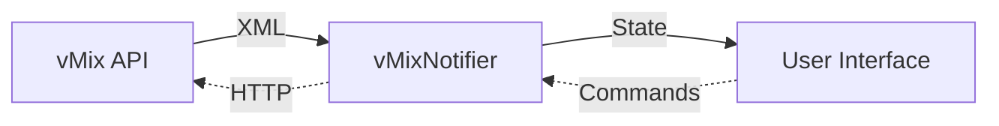

# 📡 Flutter vMix Remote Controller

A production-oriented Flutter controller for vMix, built with a clean, scalable architecture using a Riverpod-driven real-time updates.

The app connects to a vMix instance, retrieves its live state, and provides an interface for switching, overlays, input management, and basic monitoring.

It serves both as a real working tool and as a reference architecture for apps that rely on:

- Reactive state management
- External device control
- Periodic polling of remote API
- Parsing structured data (XML → model)
- Persistent, user-customizable settings

|  |
|:--:|
| *Control panel connected to a vMix instance with 87 inputs* |

## 🚀 Features

### ✔ Connect to a vMix instance

|  |  |
|:--:|:--:|
| *Connecting to a vMix instance* | *Animation highlighting that the last connection is available* |

- IP, port, and password input
- Connection test
- Error handling for network/timeout/invalid responses
- Persisted connection settings

### ✔ Real-time vMix status updates

Fetched through:

- A Periodic polling of remote API that feeds Riverpod’s StateNotifier, ensuring the UI stays synchronized with the vMix state

A StateNotifier that:

- Parses XML into strongly typed models
- Exposes updates via Riverpod
- Handles connection failures gracefully

### ✔ Complete lightweight control panel

|  |  | 
|:--:| :--:| 
| *Changing the preview input and performing a fade transition* | *Choose an input, assign it to an overlay channel, and insert it into the output* |

- Live list of inputs
- Input actions: single tap to preview, double tap for a direct cut, and long press to insert the input to an overlay channel
- Program & Preview indicators
- CUT, FADE, and transitions
- Overlay toggle buttons
- Tally colors (Preview/Program state)
- Error + offline indicators
- Auto-refresh / adjustable polling interval

### ✔ Settings & Customization

|  |  |
|:--:|:--:|
| *Changing theme mode* | *Settings* |

- Light / Dark / System theme
- Polling speed selection
- All settings saved via SharedPreferences

### ✔ Clean, scalable architecture

- features/ grouped by domain (home, panel, vmix, settings)
- Clear separation of UI, state, and business logic

## 📁 Project Structure

lib/  
├── main.dart  
├── core/  
│ ├── constants/  
│ ├── theme/  
│ ├── utils/  
│ └── validators/  
└── features/  
 ├── home/  
 ├── panel/  
 ├── settings/  
 └── vmix/

## 🧱 Architecture Overview

The app follows a reactive polling architecture designed for stability and clear separation of concerns.

### Data Flow

The app uses a **Repository pattern** to fetch raw data, which is parsed by a dedicated **XML Parser** and managed by a **StateNotifier**. This notifier serves as the single source of truth, handling polling loops and emitting immutable state updates to the **UI**.

### Diagram

## Core principles:

- **Repository Pattern**: Network logic is isolated from state management.
- **StateNotifier**: Using Riverpod's `StateNotifier` allows for complex state logic (polling loops, error tracking) beyond simple streams.
- **Immutable State**: `VmixState` and its children are immutable, ensuring predictable UI updates.
- **Defensive Parsing**: The XML parser handles missing keys and malformed data gracefully to prevent app crashes.

## 🧪 What this project demonstrates

- Integration of Flutter with an external live-control system (vMix)
- A resilient polling loop — the method used to approximate real-time vMix state — with customizable intervals, timeouts, and error handling
- Fault-tolerant connection management that recovers from failures gracefully
- Clean, scalable architecture built around Riverpod and StateNotifiers
- Modular screens and reusable UI components
- Fully reactive interfaces driven by synchronized external state
- Light/Dark theme switching with persistent user preferences
- Parsing and modeling structured XML data from a remote source
- Local storage of app configuration and connection settings
- Practical control surfaces designed for real production workflows
- Micro-animations used to signal state changes and draw user attention to important events

## 📄 Links

- [vMix HTTP API](https://www.vmix.com/help28/DeveloperAPI.html)

## 📄 License

MIT License — you may freely use this project for learning, extending, or as a reference architecture.
